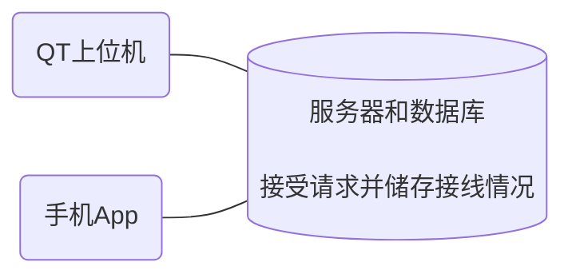

# 组会报告

徐寅哲 2022.10

---
layout: two-cols
---

# 接线提醒项目概况

   

::right::

 

## 完整流程详解

 

1. **QT上位机**通过写入请求将要接线处的位置发给**服务器**
2. **服务器**数据库记录下要接线的位置
3. **App**刷新读取数据库中要接线的位置，并显示出来
4. 工作人员完成该处接线后点击按钮
5. **App**通过写入请求将完成接线处的位置发给**服务器**
6. **服务器**将这些位置改成已接线
7. **QT上位机**读取数据库得知是否完成接线

---

 

## 目前存在的问题

 

1. 接完后QT并不会立即知道，需要主动去查
2. Windows系统限制，一旦重启需要接个屏幕登录进系统

 

## 我的解决方案

 

1. QT上位机不断循环读取，比如每10分钟主动查询一次
2. 装一台 Linux

--- 

# 目前的学习

细致的重学了一遍 JavaScript ，并仿写了几个小游戏

 

<MineSweeper />